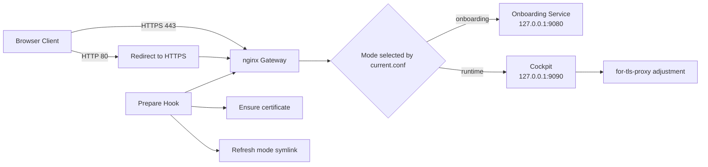
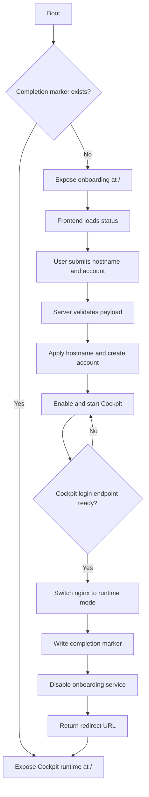

# First-Boot Onboarding

This note captures the current IOT2050 first-boot onboarding control flow and
the handoff from the temporary onboarding service to the nginx-fronted Cockpit
runtime.

For the broader design covering all current implementations under
[meta-example/recipes-webui](../meta-example/recipes-webui), see
[doc/recipes-webui.md](recipes-webui.md).

## Runtime Topology

- External entry point: nginx on ports `80` and `443`
- HTTP on `80` redirects to HTTPS on `443`
- Onboarding backend: Node.js HTTP service on `127.0.0.1:9080`
- Cockpit backend: loopback-only `cockpit.socket` on `127.0.0.1:9090`
- Runtime entrypoint: nginx proxies `/` to Cockpit only

At the time of writing, the runtime nginx configuration no longer exposes a
separate `/webui` reverse-proxy path. The public runtime interface is Cockpit
at `/`, where post-login plugins such as Extended IO can be loaded.

## Proxy Logic Diagram

The diagram shows:

- nginx as the only public HTTPS entrypoint
- the mode symlink selecting onboarding or runtime behavior
- onboarding proxied to `127.0.0.1:9080`
- runtime proxied to Cockpit on `127.0.0.1:9090`
- startup hooks that ensure certs and refresh the active mode
- Cockpit proxy adjustments required for post-login access

## Onboarding Flow Diagram

The flow covers:

- first access while the gateway is in onboarding mode
- frontend bootstrap through `GET /api/status`
- client-side and server-side validation around `POST /api/complete`
- user creation and hostname application via the Python helper
- Cockpit startup and readiness probing on `127.0.0.1:9090/cockpit/login`
- gateway mode switch from `onboarding` to `runtime`
- redirect to Cockpit and the redirect fallback behavior

## Control Flow Summary

1. On boot, the gateway selector checks whether the completion marker exists.
2. Without the marker, nginx exposes the onboarding service at `/`.
3. The frontend loads status information and collects hostname and user input.
4. The backend validates the payload and invokes the apply helper.
5. The helper updates the hostname, creates the non-root account, and stores a
   request snapshot.
6. The backend enables and starts Cockpit, then waits until the login endpoint
   responds.
7. After Cockpit is ready, the backend switches nginx into runtime mode,
   writes the completion marker, disables the onboarding service, and returns a
   redirect URL.
8. The browser navigates to Cockpit at `/`.

## Persistent State

- `/var/lib/iot2050-firstboot-onboarding/complete`
  Marks onboarding as finished and prevents the service from starting again.
- `/var/lib/iot2050-firstboot-onboarding/last-request.json`
  Stores the last apply attempt and result for diagnostics.

## Related Implementation

- Broader architecture and package overview: [doc/recipes-webui.md](recipes-webui.md)
- Frontend logic: [meta-example/recipes-webui/iot2050-firstboot-onboarding/files/www/app.js](../meta-example/recipes-webui/iot2050-firstboot-onboarding/files/www/app.js)
- HTTP server and runtime-switch logic: [meta-example/recipes-webui/iot2050-firstboot-onboarding/files/iot2050-firstboot-onboarding.js](../meta-example/recipes-webui/iot2050-firstboot-onboarding/files/iot2050-firstboot-onboarding.js)
- User and hostname application helper: [meta-example/recipes-webui/iot2050-firstboot-onboarding/files/iot2050-firstboot-apply-user.py](../meta-example/recipes-webui/iot2050-firstboot-onboarding/files/iot2050-firstboot-apply-user.py)
- Service unit: [meta-example/recipes-webui/iot2050-firstboot-onboarding/files/iot2050-firstboot-onboarding.service](../meta-example/recipes-webui/iot2050-firstboot-onboarding/files/iot2050-firstboot-onboarding.service)
- nginx gateway package: [meta-example/recipes-webui/iot2050-web-gateway-nginx/iot2050-web-gateway-nginx_1.0.0.bb](../meta-example/recipes-webui/iot2050-web-gateway-nginx/iot2050-web-gateway-nginx_1.0.0.bb)

## Retest Notes

- To re-arm onboarding for another test, remove
  `/var/lib/iot2050-firstboot-onboarding/complete`.
- If onboarding is inactive after a previous successful run, that is expected
  because the systemd unit uses `ConditionPathExists=!.../complete`.
