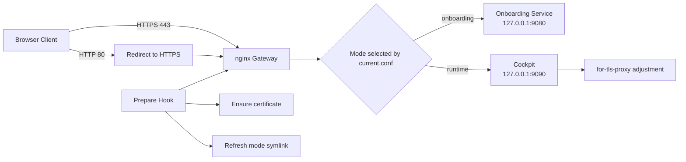
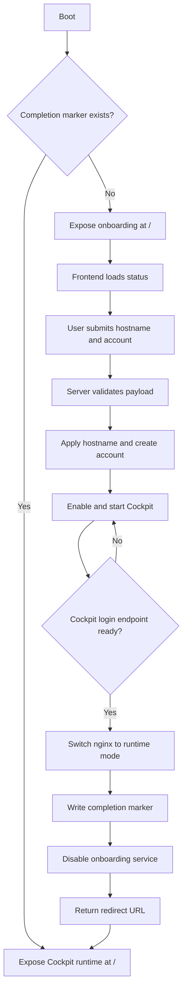

# First-Boot Onboarding

This note captures the current IOT2050 first-boot onboarding control flow and
the handoff from the temporary onboarding service to the nginx-fronted Cockpit
runtime.

## Runtime Topology

- External entry point: nginx on ports `80` and `443`
- HTTP on `80` redirects to HTTPS on `443`
- Onboarding backend: Node.js HTTP service on `127.0.0.1:9080`
- Cockpit backend: loopback-only `cockpit.socket` on `127.0.0.1:9090`
- Runtime entrypoint: nginx proxies `/` to Cockpit only

## Proxy Logic Diagram

```mermaid
flowchart LR
  Client[Browser Client] -->|HTTPS 443| Nginx[nginx Gateway]
  Client -->|HTTP 80| Redirect[Redirect to HTTPS]
  Redirect --> Nginx

  Nginx --> Mode{Mode selected by current.conf}
  Mode -->|onboarding| Onboarding[Onboarding Service\n127.0.0.1:9080]
  Mode -->|runtime| Cockpit[Cockpit\n127.0.0.1:9090]

  Prep[Prepare Hook] --> Cert[Ensure certificate]
  Prep --> Select[Refresh mode symlink]
  Prep --> Nginx

  Cockpit --> WS[for-tls-proxy adjustment]
```

## Onboarding Flow Diagram

```mermaid
flowchart TD
  A[Boot] --> B{Completion marker exists?}
  B -->|No| C[Expose onboarding at /]
  B -->|Yes| R[Expose Cockpit runtime at /]

  C --> D[Frontend loads status]
  D --> E[User submits hostname and account]
  E --> F[Server validates payload]
  F --> G[Apply hostname and create account]
  G --> H[Enable and start Cockpit]
  H --> I{Cockpit login endpoint ready?}
  I -->|No| H
  I -->|Yes| J[Switch nginx to runtime mode]
  J --> K[Write completion marker]
  K --> L[Disable onboarding service]
  L --> M[Return redirect URL]
  M --> R
```

## Persistent State

- `/var/lib/iot2050-firstboot-onboarding/complete`
  Marks onboarding as finished and prevents the service from starting again.

## Cockpit proxy overrides

The gateway ships a matched set of Cockpit overrides:

- `cockpit.socket` listens on `127.0.0.1:9090`
- `cockpit.service` runs `cockpit-tls --no-tls`
- `cockpit-wsinstance-http.service` runs `cockpit-ws --for-tls-proxy --port=0`

Without that combination, nginx would terminate TLS correctly, but Cockpit can
still fail after login because the websocket/origin path would not match the
proxied HTTPS deployment model.

## Build Profiles and Security Boundaries

- The Dev compatibility fragment (`kas/opt/dev.yml`) does not install this
  service. In that profile the gateway selects the Cockpit runtime directly
  and the preconfigured development accounts are used instead.
- The helper rejects `root` as an onboarding username and removes the newly
  created account if password setup fails.
- Final password acceptance is decided by the system PAM policy; the page
  performs matching local checks only for immediate feedback.
- The completion marker is written only after Cockpit is ready and nginx has
  switched to runtime mode.
