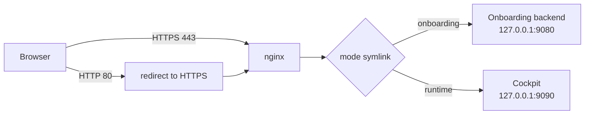
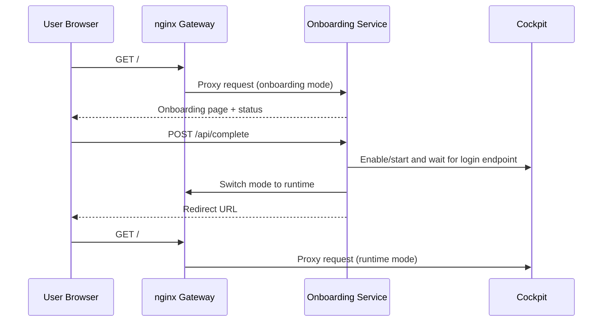

# Web UI Recipes In meta-example

This document describes all current implementations under
`meta-example/recipes-webui` and how they work together at runtime.

This directory does not contain the SM Extended IO management UI. That runtime
management UI now lives in `meta-sm/recipes-app/iot2050-eio-webui` as a
Cockpit plugin.

As of the current tree, this directory contains two recipe groups:

| Recipe | Output package | Purpose |
| ------ | -------------- | ------- |
| [meta-example/recipes-webui/iot2050-firstboot-onboarding](../meta-example/recipes-webui/iot2050-firstboot-onboarding) | `iot2050-firstboot-onboarding` | First-boot onboarding backend, frontend, and system integration logic |
| [meta-example/recipes-webui/iot2050-web-gateway-nginx](../meta-example/recipes-webui/iot2050-web-gateway-nginx) | `iot2050-web-gateway-nginx` | Public nginx HTTPS gateway in front of onboarding and Cockpit |

## Why These Recipes Exist

The design separates the first-boot setup experience from the steady-state
management interface.

- `iot2050-firstboot-onboarding` owns the setup workflow.
- `iot2050-web-gateway-nginx` owns the external web entrypoint.
- Cockpit remains loopback-only and is exposed externally only through nginx.
- Post-login management plugins such as Extended IO are provided by Cockpit
  packages, not by additional public reverse-proxy paths.

This gives the image one public HTTPS entrypoint while still allowing the
system to present different behavior before and after initial provisioning.

## Runtime Topology

The current topology is intentionally simple:

- External HTTP on port `80` only redirects to HTTPS.
- External HTTPS on port `443` is terminated by nginx.
- In onboarding mode, nginx proxies `/` to the onboarding service on `127.0.0.1:9080`.
- In runtime mode, nginx proxies `/` to Cockpit on `127.0.0.1:9090`.
- Cockpit itself listens only on loopback via `cockpit.socket`.

At the time of writing, the runtime nginx config only exposes Cockpit at `/`.
There is no active `/webui` reverse-proxy path in the current
`meta-example/recipes-webui` implementation, and SM Extended IO management is
expected to appear inside Cockpit instead.

## nginx Proxy Logic

### What The Proxy Layer Actually Does

`iot2050-web-gateway-nginx` is not just a config bundle. It establishes the
runtime contract between the public network and the local services.

1. It makes nginx the only public web-facing process.
2. It generates a local certificate if none exists yet.
3. It selects the effective nginx mode by switching a symlink.
4. It removes legacy default nginx configs.
5. It opens ports `80` and `443` through firewalld and removes legacy direct
   service exposure such as plain Cockpit on `9090`.
6. It adjusts Cockpit so reverse proxying over HTTPS works after login.

## Onboarding Service Logic

The onboarding backend is a local HTTP service listening on `127.0.0.1:9080`.
It becomes reachable externally only when nginx is in onboarding mode.

Main endpoints:

| Endpoint | Method | Purpose |
| -------- | ------ | ------- |
| `/` | `GET` | Serve the onboarding page |
| `/api/status` | `GET` | Return hostname and public entrypoint hints |
| `/api/complete` | `POST` | Validate input, apply user and hostname, then switch to runtime |
| `/po.js` | `GET` | Return the best localized translation bundle |
| `/healthz` | `GET` | Simple health check |

Persistent state:

- `/var/lib/iot2050-firstboot-onboarding/complete`
  Marks onboarding as finished. Its presence also prevents the service from
  starting again because the systemd unit uses `ConditionPathExists=!...`.
- `/var/lib/iot2050-firstboot-onboarding/last-request.json`
  Stores the last apply attempt and its result.

## Onboarding Logic Flow

## Component Details

### 1. iot2050-firstboot-onboarding

Responsibilities:

- Serve the first-boot HTML, CSS, JavaScript, favicon, and localization bundles.
- Validate onboarding form data on both client and server sides.
- Reject `root` explicitly as a valid onboarding username.
- Create the requested administrator account through a Python helper.
- Apply the hostname and maintain `/etc/hostname` and `/etc/hosts`.
- Start Cockpit, wait for it to become reachable, then switch nginx into
  runtime mode.

Implementation notes:

- The backend is intentionally loopback-only. nginx controls whether it is
  publicly reachable.
- The translation bundles are generated during package install from one source
  catalog rather than maintained as separate handwritten assets.
- The service stops itself after a successful handoff. A later reboot sees the
  completion marker and does not start onboarding again.

### 2. iot2050-web-gateway-nginx

Responsibilities:

- Provide one public HTTPS entrypoint for the image.
- Select between onboarding and runtime nginx configs.
- Prepare certificates and active mode before nginx starts.
- Keep Cockpit on loopback while still allowing browser access through nginx.
- Normalize proxy headers, upgrade handling, and forwarded HTTPS metadata.

Implementation notes:

- The selector script chooses `onboarding` when the completion marker is
  absent, and `runtime` when it is present.
- The nginx drop-in clears the vendor `ExecStartPre` lines so the gateway
  preparation step runs before the final nginx config test.
- The Cockpit overrides are a matched set:
  - `cockpit.socket` listens on `127.0.0.1:9090`
  - `cockpit.service` runs `cockpit-tls --no-tls`
  - `cockpit-wsinstance-http.service` runs `cockpit-ws --for-tls-proxy --port=0`

Without that combination, nginx would terminate TLS correctly, but Cockpit can
still fail after login because the websocket/origin path would not match the
proxied HTTPS deployment model.

## Integration Sequence

Boot-time behavior:

1. The gateway package post-install removes default nginx configs, configures
   firewalld, enables nginx, and selects mode automatically.
2. nginx startup runs the prepare script, which ensures certificates exist and
   refreshes the active mode symlink.
3. If the completion marker is absent, onboarding is exposed at `/`.
4. If the completion marker is present, Cockpit is exposed at `/`.

Successful onboarding handoff:

1. The onboarding API applies hostname and user creation.
2. The backend enables and starts Cockpit.
3. The backend waits until `127.0.0.1:9090/cockpit/login` is responsive.
4. The gateway mode switches to runtime.
5. The completion marker is written.
6. The frontend is redirected to the Cockpit landing page.

## Retest And Troubleshooting Notes

- To re-arm onboarding for another test, remove
  `/var/lib/iot2050-firstboot-onboarding/complete`.
- If onboarding is inactive after a previous successful run, that is expected
  because the unit is guarded by `ConditionPathExists=!.../complete`.
- If Cockpit login works but the post-login page fails behind nginx, verify the
  `cockpit-wsinstance-http.service.d/for-tls-proxy.conf` override is present.
- The current implementation under `meta-example/recipes-webui` documents
  onboarding and Cockpit only. If new proxied applications are added later,
  extend the runtime-mode section instead of bypassing the gateway.
