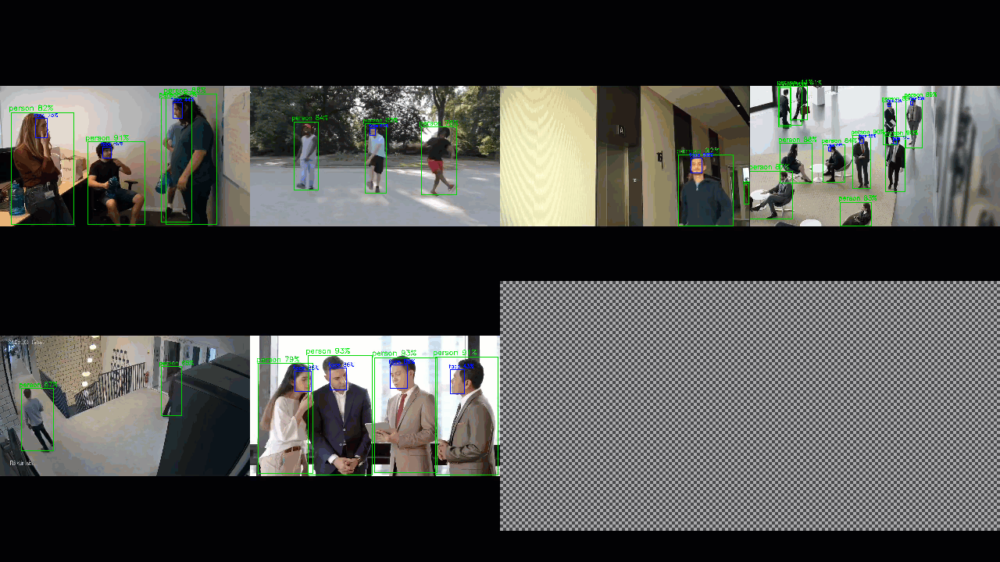

# Hailo TAPPAS

TAPPAS is Hailo's set of full application examples, implementing
pipeline elements and pre-trained AI tasks. According to Hailo's
announcement, it can be used for evaluations, reference code, and demos:
 - Accelerating time to market by reducing development time and
  deployment effort
 - Simplifying integration with Hailo’s runtime SW stack
 - Providing a starting point for customers to fine-tune their
  applications

If facial landmarking is necessary for your practice, please download the
following binaries into `/usr/lib/hailo-post-processes/post_processes_data`:
- [w_exp_base.npy](https://github.com/hailo-ai/tappas/raw/refs/tags/v3.29.1/core/hailo/libs/postprocesses/post_processes_data/w_exp_base.npy)
- [w_shp_base.npy](https://github.com/hailo-ai/tappas/raw/refs/tags/v3.29.1/core/hailo/libs/postprocesses/post_processes_data/w_shp_base.npy)

> Note: All paths starting with `/usr/*` refer to directories on the device.
> The same applies to the paths mentioned below.

Alternatively, you can use the following shell script to download all the
required files for facial landmarking:

```sh
#!/bin/bash

mkdir -p /usr/lib/hailo-post-processes/post_processes_data/

# Download the facial landmarking library data
wget -O /usr/lib/hailo-post-processes/post_processes_data/w_exp_base.npy https://github.com/hailo-ai/tappas/raw/refs/tags/v3.29.1/core/hailo/libs/postprocesses/post_processes_data/w_exp_base.npy
wget -O /usr/lib/hailo-post-processes/post_processes_data/w_shp_base.npy https://github.com/hailo-ai/tappas/raw/refs/tags/v3.29.1/core/hailo/libs/postprocesses/post_processes_data/w_shp_base.npy
```

Three typical demos are integrated and supported by default in this
TAPPAS:
 - Detection Pipeline
 - License Plate Recognition
 - Multi-Stream Object Detection

## Detection Pipeline

This pipeline aims for real-time, high-accuracy object detection on a
single video stream using an embedded host. The yolov5m_yuv model needs
an input video resolution of HD (720p), while the yolov8m model requires
an RGB input video resolution of 640x640. In the demo, a 480p YUY2 camera
input is used, which is then converted to HD (720p) or 640x640 RGB in the
GStreamer pipeline for the model.

This demo originates from the IMX8 Demo. For the original version, visit
the following link:

[IMX8 Detection Demo](https://github.com/hailo-ai/tappas/tree/v3.29.1/apps/h8/gstreamer/imx8/detection).

### Drill Down

The camera sends the raw video stream, encoded in YUV color format using
the YUY2 layout. The data passes through Hailo’s runtime software
library, HailoRT, and the Hailo PCIe driver. The data format remains
unmodified and is sent to the Hailo-8 device as is.

Hailo-8’s NN core handles data preprocessing, including decoding the
YUY2 scheme, converting from YUV to RGB color space, and resizing the
frames to the resolution expected by the deep learning detection model.

The Hailo Dataflow Compiler supports adding these preprocessing stages
to any model during compilation. In this case, they are added before the
YOLOv5m detection model.

### Run Options

First, download the following files to `/usr/share/tappas/detection/resources/`.

- [YOLOv5m Model](https://hailo-tappas.s3.eu-west-2.amazonaws.com/v3.29/imx8/hefs/yolov5m_yuv.hef)
- [YOLOv8m Model](https://hailo-model-zoo.s3.eu-west-2.amazonaws.com/ModelZoo/Compiled/v2.14.0/hailo8/yolov8m.hef)

Or, you can use the following shell script to download all the required
files for the Detection demo:

```sh
#!/bin/bash

mkdir -p /usr/share/tappas/detection/resources/

# Download the YOLOv5m Model
wget -O /usr/share/tappas/detection/resources/yolov5m_yuv.hef https://hailo-tappas.s3.eu-west-2.amazonaws.com/v3.29/imx8/hefs/yolov5m_yuv.hef
# Download the YOLOv8m Model
wget -O /usr/share/tappas/detection/resources/yolov8m.hef https://hailo-model-zoo.s3.eu-west-2.amazonaws.com/ModelZoo/Compiled/v2.14.0/hailo8/yolov8m.hef
```

Then, run the detection script:

```sh
/usr/share/tappas/detection/detection.sh -h
Detection pipeline usage:

Options:
  --help              Show this help
  -i INPUT --input INPUT          Set the video source (default /dev/video0)
  --show-fps          Print fps
  --print-gst-launch  Print the ready gst-launch command without running it
  --use-raw           Use the raw pipeline (YUY2 Model)
```

The output video should be similar to:


### Configuration

The app's post-process parameters can be configured via a JSON file
located at `/usr/share/tappas/detection/resources/configs/yolov.json`.

## License Plate Recognition

The LPR app uses YOLOv5m for vehicle detection, tiny-YOLOv4 for license
plate detection, and LPRNet for OCR extraction with HailoNet
network-switch capability.

`license_plate_recognition.sh` demonstrates model scheduling in a
complex pipeline with inference-based decision making. The task is to
detect and track vehicles and then detect/extract license plate numbers
from newly tracked instances.

This demo originates from the IMX8 Demo. For the original version, visit
the following link:

[IMX8 LPR Demo](https://github.com/hailo-ai/tappas/tree/v3.29.1/apps/h8/gstreamer/imx8/license_plate_recognition)

### Configuration

The YOLO post-process parameters can be configured via a JSON file
located at `/usr/share/tappas/license_plate_recognition/resources/configs`.

### Run Option
First, download the following files to `/usr/share/tappas/license_plate_recognition/resources/`.

- [YOLOv5m Model](https://hailo-tappas.s3.eu-west-2.amazonaws.com/v3.29/imx8/hefs/yolov5m_vehicles_no_ddr_yuy2.hef)
- [Tiny YOLOv4 Model](https://hailo-tappas.s3.eu-west-2.amazonaws.com/v3.29/imx8/hefs/tiny_yolov4_license_plates_yuy2.hef)
- [LPR Raw Data](https://hailo-tappas.s3.eu-west-2.amazonaws.com/v3.29/imx8/media/lpr.raw)
- [LPRNet Model](https://hailo-tappas.s3.eu-west-2.amazonaws.com/v3.29/imx8/hefs/lprnet_yuy2.hef)

Or, you can use the following shell script to download all the required
files for the LPR demo:

```sh
#!/bin/bash

mkdir -p /usr/share/tappas/license_plate_recognition/resources/

# Download the YOLOv5m Model
wget -O /usr/share/tappas/license_plate_recognition/resources/yolov5m_vehicles_no_ddr_yuy2.hef https://hailo-tappas.s3.eu-west-2.amazonaws.com/v3.29/imx8/hefs/yolov5m_vehicles_no_ddr_yuy2.hef

# Download the Tiny YOLOv4 Model
wget -O /usr/share/tappas/license_plate_recognition/resources/tiny_yolov4_license_plates_yuy2.hef https://hailo-tappas.s3.eu-west-2.amazonaws.com/v3.29/imx8/hefs/tiny_yolov4_license_plates_yuy2.hef

# Download the LPR Raw Data
wget -O /usr/share/tappas/license_plate_recognition/resources/lpr.raw https://hailo-tappas.s3.eu-west-2.amazonaws.com/v3.29/imx8/media/lpr.raw

# Download the LPRNet Model
wget -O /usr/share/tappas/license_plate_recognition/resources/lprnet_yuy2.hef https://hailo-tappas.s3.eu-west-2.amazonaws.com/v3.29/imx8/hefs/lprnet_yuy2.hef
```

Then, run the LPR script:

```sh
/usr/share/tappas/license_plate_recognition/license_plate_recognition.sh -h
LPR pipeline usage:

Options:
  -h --help                  Show this help
  --show-fps                 Print fps
  --print-gst-launch         Print the ready gst-launch command without running it
  --print-device-stats       Print the power and temperature measured

```

The output video should be like:


### How the Application Works

This app uses the HailoRT Model Scheduler. Read more about HailoRT Model
Scheduler GStreamer integration at
[HailoNet](https://github.com/hailo-ai/tappas/blob/master/docs/elements/hailo_net.rst).

## Multi-Stream Object Detection

This GStreamer pipeline demonstrates object detection on multiple file
streams.

All streams are processed in parallel through the decode and scale
phases, entering the Hailo device frame by frame.

Afterwards, post-process and drawing phases add the classified objects
and bounding boxes to each frame. The final step matches each frame back
to its respective stream and outputs all of them to the display.

All elements in this pipeline operate in NV12 format, and the HEF file
is also in NV12 format, so no format conversion is performed.

This demo originates from the IMX8 Demo. For the original version, visit
the following link:

`IMX8 Multi-Stream Detection Demo <https://github.com/hailo-ai/tappas/tree/v3.29.1/apps/h8/gstreamer/imx8/multistream_detection>`_.

### Run Option

First, download the following files to `/usr/share/tappas/multistream_detection/resources/`.

- [YOLOv5s Person Face Model](https://hailo-tappas.s3.eu-west-2.amazonaws.com/v3.29/general/hefs/yolov5s_personface_nv12.hef)
- [Detection Video 0](https://hailo-tappas.s3.eu-west-2.amazonaws.com/v3.29/imx8/media/multistream_detection_h265/detection0.mp4)
- [Detection Video 1](https://hailo-tappas.s3.eu-west-2.amazonaws.com/v3.29/imx8/media/multistream_detection_h265/detection1.mp4)
- [Detection Video 2](https://hailo-tappas.s3.eu-west-2.amazonaws.com/v3.29/imx8/media/multistream_detection_h265/detection2.mp4)
- [Detection Video 3](https://hailo-tappas.s3.eu-west-2.amazonaws.com/v3.29/imx8/media/multistream_detection_h265/detection3.mp4)
- [Detection Video 4](https://hailo-tappas.s3.eu-west-2.amazonaws.com/v3.29/imx8/media/multistream_detection_h265/detection4.mp4)
- [Detection Video 5](https://hailo-tappas.s3.eu-west-2.amazonaws.com/v3.29/imx8/media/multistream_detection_h265/detection5.mp4)

Or, you can use the following shell script to download all the required
files for the Multi-Stream Object Detection demo:

```sh
#!/bin/bash

mkdir -p /usr/share/tappas/multistream_detection/resources/

# Download the YOLOv5s Person Face Model
wget -O /usr/share/tappas/multistream_detection/resources/yolov5s_personface_nv12.hef https://hailo-tappas.s3.eu-west-2.amazonaws.com/v3.29/general/hefs/yolov5s_personface_nv12.hef

# Download the detection videos
for i in {0..5}; do
  wget -O /usr/share/tappas/multistream_detection/resources/detection${i}.mp4 https://hailo-tappas.s3.eu-west-2.amazonaws.com/v3.29/imx8/media/multistream_detection_h265/detection${i}.mp4
done
```

Then, run the Multi-Stream Object Detection script:

```sh
/usr/share/tappas/multistream_detection/multi_stream_detection.sh -h
Multistream Detection hailo - pipeline usage:

Options:
  --help                          Show this help
  --show-fps                      Printing fps
  --fakesink                      Run the application without display
  --num-of-sources NUM            Setting number of sources to given input (default and maximum value is 6)
  --print-gst-launch              Print the ready gst-launch command without running it
```

The output video should be like:



### Configuration

The app's post-process parameters can be configured via a JSON file
located at `/usr/share/tappas/multistream_detection/resources/configs/yolov5_personface.json`.

## Note

For optimal performance and additional applications, please visit the
[Hailo website](https://hailo.ai/) and the
[Hailo Open Source repository](https://github.com/hailo-ai). To write
your own application, refer to the
[Writing Your Own Application](https://github.com/hailo-ai/tappas/tree/master/docs/write_your_own_application)
guide. If you plan to retrain the models, it is recommended to first read
the [Retraining TAPPAS Models](https://github.com/hailo-ai/tappas/blob/master/docs/write_your_own_application/retraining-tappas-models.rst) page.
