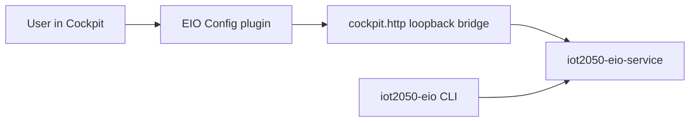

# IOT2050 EIO WebUI

This package provides the Extended IO management UI for the IOT2050 SM variant.
It is installed as a Cockpit plugin and is reached through the existing Cockpit
runtime rather than a standalone web service.

## Runtime Model

- UI package id: `iot2050-eio-webui`
- Cockpit navigation label: `EIO Config`
- Public entrypoint: the existing HTTPS gateway in front of Cockpit
- Backend integration: loopback HTTP bridge inside `iot2050-eio-service`
- CLI relation: independent; the Cockpit page no longer shells out to CLI

## Request Flow



### Backend Contract

The Cockpit page uses `cockpit.http()` to talk to a loopback-only HTTP bridge
served by `iot2050-eio-service`. That bridge reuses the same deploy/retrieve
logic as the gRPC service, so the UI and CLI are separate clients of the same
backend instead of one depending on the other.

The static Cockpit page still cannot use browser-native raw gRPC directly.
This bridge is the smallest transport layer that keeps CLI behavior unchanged
while removing the UI to CLI dependency.

Bridge endpoints:

- `GET /api/v1/eio/config`: retrieve current YAML configuration
- `PUT /api/v1/eio/config`: deploy YAML configuration with body `{ "yaml_data": "..." }`

Response contract:

- `ok`: boolean success flag
- `code`: stable machine-readable result code such as `OK`, `CONFIG_ERROR`, `INVALID_JSON`, `MISSING_YAML_DATA`, `INVALID_YAML_DATA`, `NOT_FOUND`, `METHOD_NOT_ALLOWED`
- `message`: human-readable summary
- `data`: optional payload object; retrieve returns `data.yaml_data`

## Development

The UI is built with Next.js and Material UI, but exported as static assets for
Cockpit packaging.

There are two `npm-shrinkwrap.json` files:

- `npm-shrinkwrap.json`
- `npm-shrinkwrap.json.nodev`

The `.nodev` variant is used for packaging workflows that must omit
`devDependencies`.

If any new dependency package is added, regenerate both shrinkwrap files.

Typical local workflow inside `files/`:

```sh
npm install
npm run build
```

The production package installs the generated static export under
`/usr/share/cockpit/eio-config/`.

## Feature Scope

The Cockpit plugin preserves the previous configuration features:

- import YAML configuration
- export YAML configuration
- retrieve configuration from the device
- deploy configuration to the device
- slot-based module selection and configuration

CLI compatibility is intentionally preserved via the original file-based
deploy/retrieve interface, but the UI no longer depends on it.

## Related

- CLI source: [meta-sm/recipes-app/iot2050-eio-manager/files/iot2050-eio-cli.py](../iot2050-eio-manager/files/iot2050-eio-cli.py)
- Web UI recipes overview: [doc/recipes-webui.md](../../../doc/recipes-webui.md)
