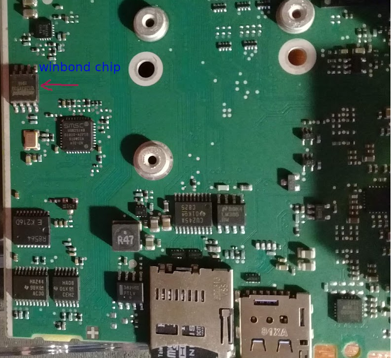

# Building and programming the boot loader

## Building the image

The boot loader for PG1 and PG2 boards is built like this:

```shell
./kas-container build kas-iot2050-boot-pg1.yml
./kas-container build kas-iot2050-boot-pg2.yml
```

After the build the boot images are under

```text
build/tmp/deploy/images/iot2050/iot2050-pg1-image-boot.bin
build/tmp/deploy/images/iot2050/iot2050-pg2-image-boot.bin
```

## Flashing the image

> :warning:
> Flashing an incorrect image may brick the device!

Write `iot2050-pgN-image-boot.bin` to an SD card and insert that into
the target device. Then boot into the U-Boot shell and execute there:

```shell
sf probe
load mmc 0:1 $loadaddr /path/to/iot2050-pgN-image-boot.bin
sf update $loadaddr 0x0 $filesize
```

## Recovering a bricked device

If the device does not come up anymore after flashing the boot loader, you can
recover it with the help of an external flash programmer. Known to work are the
Dediprog SF100 or SF600. Attach the programmer to X17, then run the following
on the host machine:

```shell
dpcmd --vcc 2 -v -u iot2050-pgN-image-boot.bin
```

Also, as alternative it is possible to use flash programmer which can work
with Winbond chips (W25Q128), as example - ch341a. The flash chip is located on
the back side of the board.

> :warning:
> This way is not preferred, please, use Dediprog flash programmers if possible.




Install flashrom with:

```shell
apt-get install flashrom
```

Attach the grabber to the flash chip, then run the following on the host machine:

```shell
flashrom -p ch341a_spi -c W25Q128.V -w iot2050-image-boot.bin
```
